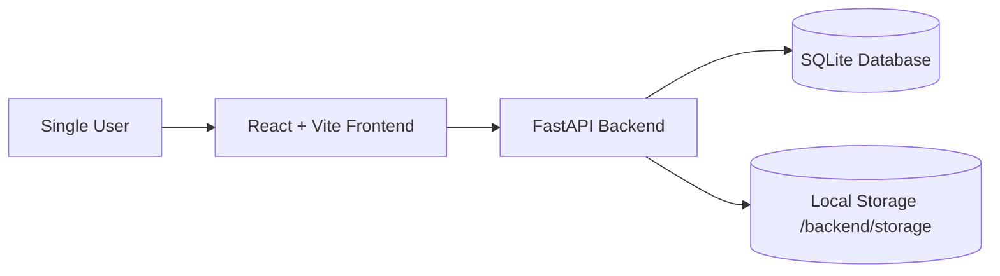
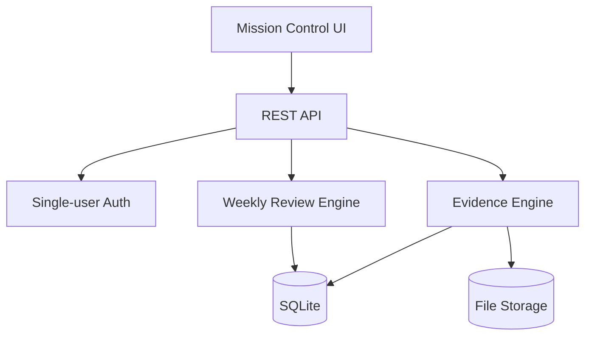

# 03 System Architecture

## Overview

Quintessence uses a React/Vite frontend, FastAPI backend, SQLite database, SQLAlchemy ORM, and local filesystem storage.

## Context diagram

## Component diagram

## Data flow

1. User logs in.
2. Frontend stores bearer token in local storage.
3. Frontend calls FastAPI endpoints.
4. Backend validates token.
5. Backend reads/writes SQLite records.
6. Evidence uploads are written to backend/storage and referenced by records.

## Security model

- Single configured user.
- HMAC-signed local bearer token.
- No public registration.
- CORS limited through environment configuration.
- Uploaded files stored locally.

## Deployment model

- Local development through uvicorn and Vite.
- Docker Compose for backend and frontend.
- SQLite volume mounted at backend/data.
- Storage volume mounted at backend/storage.
