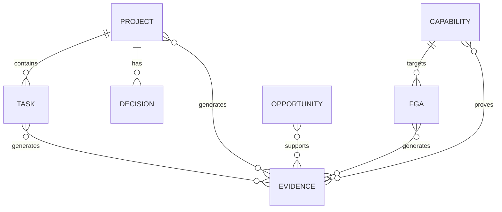

# 04 Database Design

## ERD

## Core tables

- projects
- tasks
- opportunities
- capabilities
- fgas
- evidence_items
- ai_items
- notes
- decisions
- evidence_capabilities
- evidence_projects
- evidence_tasks
- evidence_fgas
- evidence_opportunities

## Indexes

- status indexes on projects, tasks, opportunities, fgas.
- score indexes on capabilities.
- created_at indexes on evidence, decisions, notes.
- tag fields are plain text in Phase 1 for simple local search.

## Constraints

- Required names/titles on primary resources.
- Enum-like string statuses enforced by application validation.
- Evidence file paths are nullable because evidence can be metadata-only.
